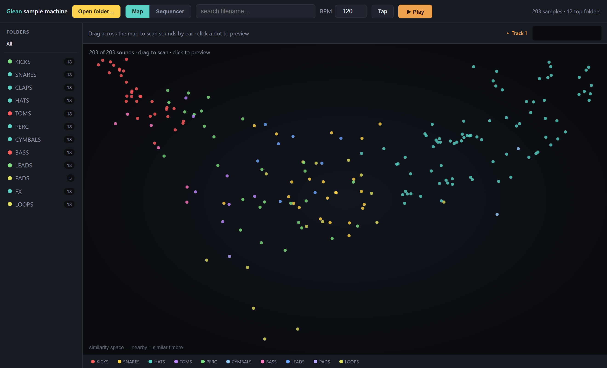
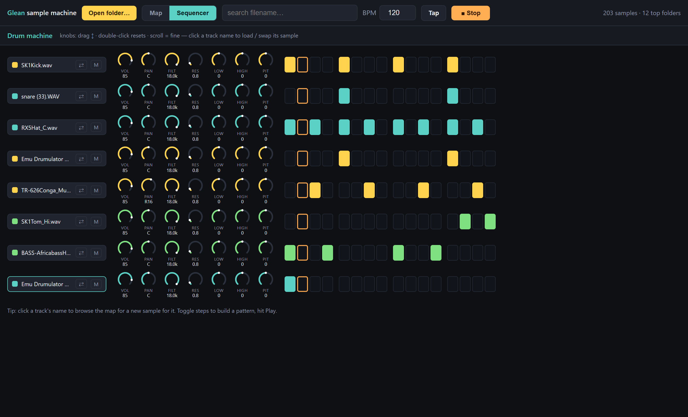

# Glean — sample browser + drum machine

**Explore your samples by *sound*, then build beats — all in the browser, no install.**

Glean analyzes the actual audio of every `.wav` in a folder, lays them out in a 2D
**similarity map** (sounds that *sound* alike sit together, colored by type), lets you
**drag across the map to audition by ear**, and drop the ones you like onto an **8-track
step sequencer** with per-track filter, EQ, pan and pitch. Inspired by XLN Audio XO and
Waves Cosmos (not affiliated with or endorsed by either).

🔗 **Live demo:** https://yonie.github.io/glean/ — zero install; open it and point it at a folder of samples. Everything runs locally; nothing is uploaded.

### The similarity map


### The drum machine


## Features

- **Sound-based map** — each sample becomes a ~17-dimensional timbre vector (envelope,
  spectral centroid/spread/rolloff/flatness, log-band energies, zero-crossing rate) and
  the whole library is projected to 2D with PCA. Similar sounds cluster; dot color is the
  sample's audio-classified type (kick, snare, hat, …) — *not* its filename.
- **Drag-to-scan** — hold the mouse and sweep across the map; it retriggers the nearest
  sound as you move, so you browse by ear. The layout is computed once over the whole
  library and stays put — folder/search just filter which dots show.
- **Folder browser** — a real folder tree with breadcrumbs; works on any folder structure.
- **Clickable legend** — toggle sound-types to filter the map by color.
- **8-track step sequencer** — 16 steps, adjustable BPM, **tap tempo**, and a permanent
  row of rotary knobs per track (VOL · PAN · FILT · RES · LOW · HIGH · PIT). Each lane is
  colored by its sample's sound. Live Web Audio playback.
- **Load / swap** — click a track to browse the map and drop a new sound onto it.

## Run it

No build step. Either use the [live demo](https://yonie.github.io/glean/), or run locally:

```bash
# clone, then serve the app folder (any static server works)
cd app && python -m http.server 8000
# open http://localhost:8000  →  "Open folder…"  →  pick a folder of .wav files
```

Opening `app/index.html` straight off disk works in most browsers too; a static server
just avoids the odd `file://` script-loading restriction.

## How the map works (and how it compares to XO / Cosmos)

The commercial tools use larger learned feature sets / ML embeddings and a non-linear
projection (t-SNE/UMAP-style). Glean uses a transparent, dependency-free pipeline:
hand-built timbre features → **linear PCA** to 2D. It produces a real similarity layout
(kicks, hats, snares, pads separate out) and is easy to read and hack, but won't be as
surgical as a trained model. The dot's discrete color label is a heuristic (~50–60% on
ambiguous one-shots — a clap can read like a snare); trust the *position* more than the
label. Swapping in UMAP/t-SNE + MFCCs is an obvious next step.

## Repo layout

```
app/                 the web app (no build step)
  index.html
  css/styles.css
  js/util.js         shared state + helpers + colors
  js/dsp.js          FFT, timbre features, PCA  (pure, reusable)
  js/audio.js        decode/audition + per-track FX chain
  js/app.js          UI: folder browser, map, sequencer, transport
tools/               Python scripts to PREP/sort a sample library (see tools/README.md)
scripts/shoot.mjs    Playwright harness that regenerates the screenshots
docs/                screenshots + build notes
```

## Roadmap

- Pattern save/load and export (MIDI / audio).
- Optional t-SNE/UMAP projection and MFCC features.
- Per-step parameter locks; more than 8 tracks.
- File System Access API to re-read a folder without re-picking.

## Support

If Glean is useful to you:

[](https://buymeacoffee.com/yonie)

## License

MIT — see [LICENSE](LICENSE).
